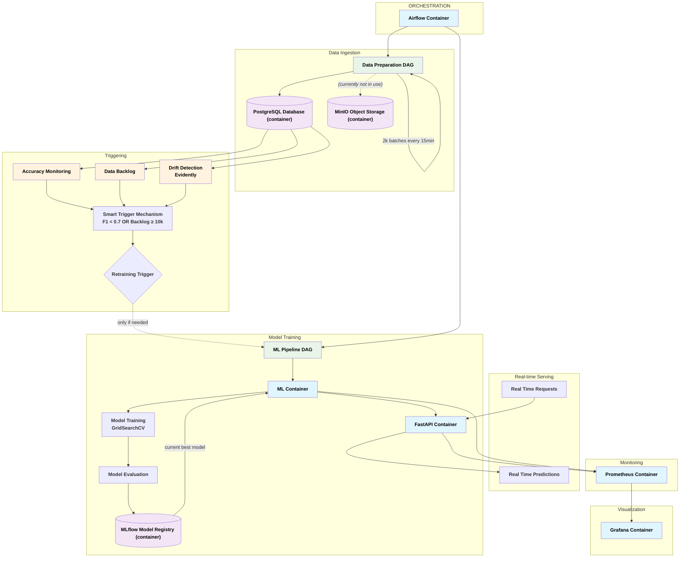
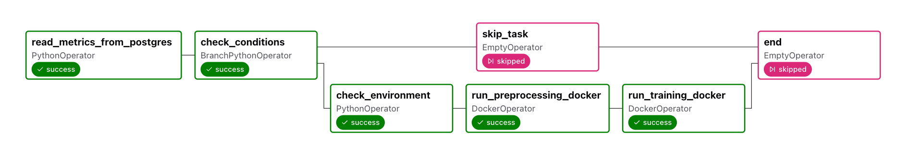
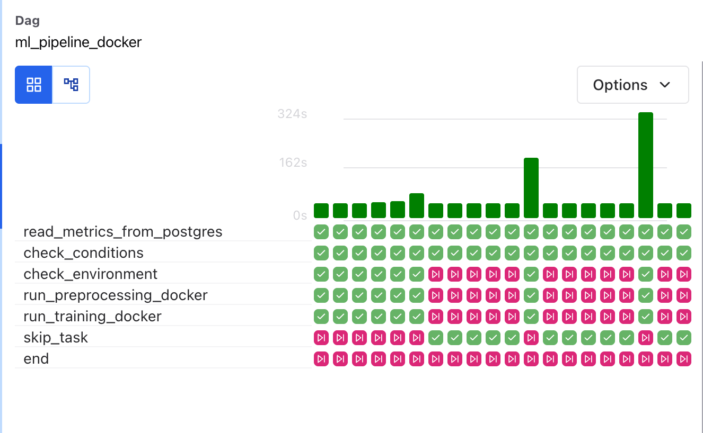
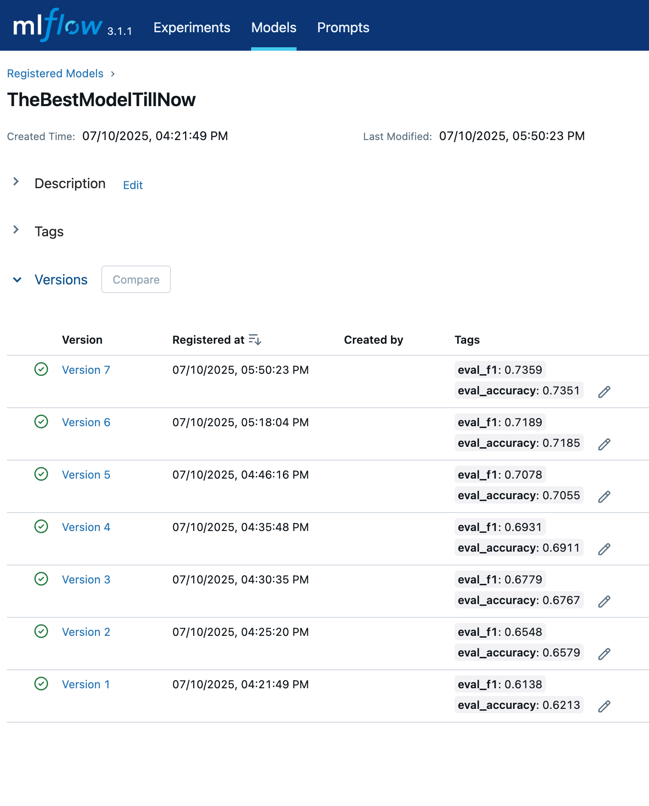
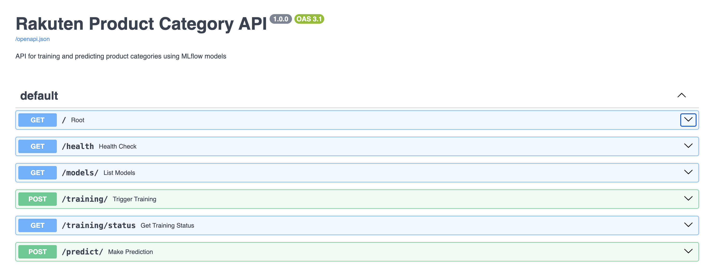
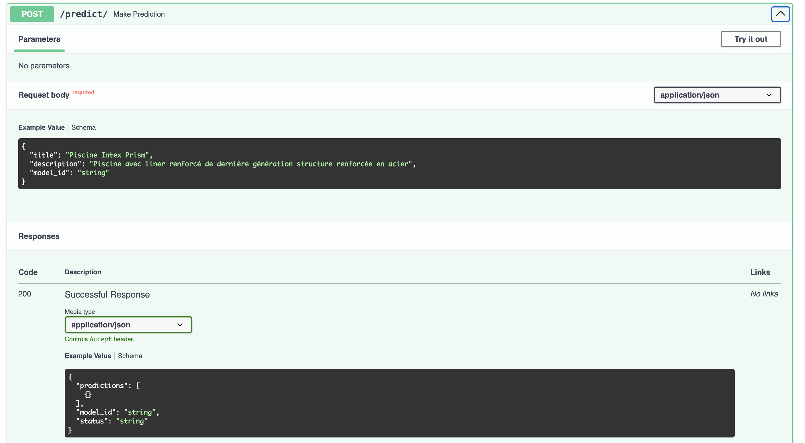
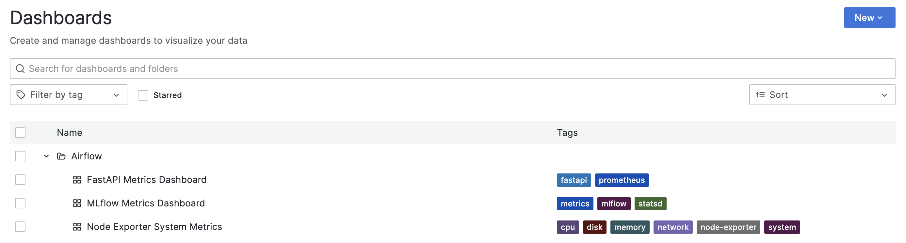
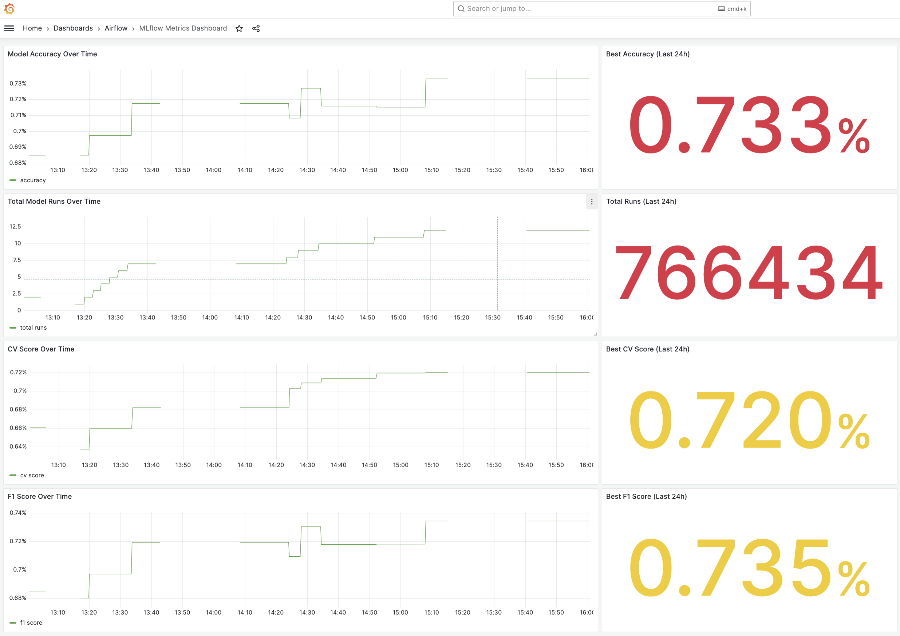
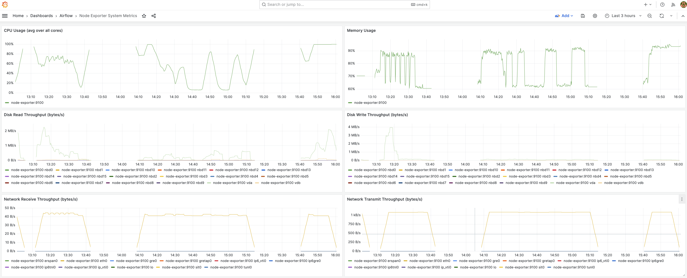

# Rakuten Product Classification - MLOps Pipeline

This project demonstrates a complete MLOps pipeline for the [Rakuten product classification challenge](https://challengedata.ens.fr/participants/challenges/35/), focusing on deployment, versioning, and operational aspects rather than model accuracy.

## Key Achievements ⭐
- **Production-Ready MLOps Pipeline**: Complete automated workflow from data ingestion to model deployment
- **Intelligent Retraining**: Smart triggers based on performance degradation and data drift (not just scheduled)
- **Real-Time API**: FastAPI service with live predictions and human-readable responses
- **Enterprise Monitoring**: Prometheus + Grafana dashboards tracking ML and system metrics
- **Containerized Architecture**: 8+ microservices orchestrated with Docker Compose
- **Operational Intelligence**: Data quality monitoring, drift detection, and automated alerts

## Table of Contents
- [Project Overview](#project-overview)
- [Project Structure](#project-structure)
- [Setup Instructions](#setup-instructions)
- [ML Pipeline Components](#ml-pipeline-components)
- [Real-time Prediction API](#real-time-prediction-api)
- [Intelligent MLOps System](#intelligent-mlops-system)
- [Docker Architecture](#docker-architecture)
- [MLOps Operational Metrics](#mlops-operational-metrics)
- [Technology Stack](#technology-stack)
- [Development & Contributing](#development--contributing)
- [Troubleshooting](#troubleshooting)
- [Future Enhancements](#future-enhancements)
- [Project Status](#project-status)

## Project Overview

- **Task**: Classify products into categories using text and image data
- **Focus**: MLOps infrastructure (MLflow, FastAPI, Docker, model versioning)
- **Models**: Classical ML pipeline with XGBoost, Random Forest, Logistic Regression, and SVM (with plans to integrate deep learning models later)
- **Current Performance**: SVM achieves 73.4% F1 score on French text classification
- **Status**: ✅ **Production-ready** with intelligent retraining and comprehensive monitoring

## Architecture Overview



## Project Structure

```
rakuten_project/
├── main.py                  # FastAPI application
├── Dockerfile.api          # FastAPI container definition  
├── requirements_api.txt    # FastAPI dependencies
├── config/                  # Configuration files
│   └── airflow.cfg         # Airflow configuration
├── dags/                    # Airflow DAGs for workflow orchestration
│   ├── ml_pipeline_docker_dag.py  # ML pipeline with smart triggers
│   ├── prepare_data_dag.py # Data preparation workflow (15min schedule)
│   ├── reset_data_dag.py   # Database reset and test data creation
│   ├── drift_detection_dag.py # Data drift monitoring (2hr schedule)
│   └── tasks/              # Airflow task modules
│       ├── ml_tasks.py     # ML pipeline tasks
│       ├── upload.py       # Data upload functions
│       ├── download.py     # Data download functions
│       └── utils.py        # Utility functions
├── containers/              # Docker container definitions
│   └── rakuten-ml/         # ML pipeline container
│       ├── Dockerfile      
│       ├── preprocessing.py 
│       ├── training.py     # Model training with GridSearchCV & quality gates
│       ├── predict.py      # Single prediction script with best model selection
│       ├── category_mapping.json # Category ID to name mapping
│       └── requirements_ml.txt # ML-specific dependencies
├── monitoring/              # Monitoring stack configuration
│   ├── prometheus.yml      # Prometheus configuration
│   └── grafana/            # Grafana dashboards and provisioning
├── scripts/                 # Setup scripts only
│   ├── 1_install_docker.sh # Install Docker and dependencies
│   ├── 2_download.sh       # Downloads Rakuten dataset
│   └── 3_run_docker.sh     # Start Docker services
├── processed_data/          # Generated ML features and metadata
├── models/                  # Trained models and encoders
├── raw_data/               # Original dataset storage
├── src/                     # Source code (legacy)
│   ├── load_minio.py       # MinIO object storage operations
│   ├── load_postgres.py    # PostgreSQL database operations
│   └── (API components completed)
├── .env                    # Environment variables
├── .gitignore
├── docker-compose.yml      # Docker services configuration
├── requirements.txt        # Main project dependencies
├── servers.json           # Database server configuration
└── README.md              # This file
```

**Note:** Data is stored in Docker containers (PostgreSQL for metadata, MinIO for images), not in local folders.

## Setup Instructions

### Clone Repository
```bash
git clone https://github.com/Pockyee/rakuten_project.git
cd rakuten_project
```

### Data Download Requirements

The Rakuten dataset requires authentication. You have two options:

**Option 1: Manual Download (Recommended)**
1. Visit [Rakuten Challenge Page](https://challengedata.ens.fr/participants/challenges/35/)
2. Log in with your credentials
3. Download `x_train.csv`, `y_train.csv`, and `x_test.csv` manually
4. **Important**: Ensure files are named exactly as follows (lowercase, no extra characters):
   - `x_train.csv`
   - `y_train.csv` 
   - `x_test.csv`
5. Remove any random characters or timestamps from filenames
6. Place them in the `raw_data/` directory

**Option 2: Use Download Script**
1. Update session cookies in `./scripts/2_download.sh` (cookies expire regularly)
2. Run `./scripts/2_download.sh`

**Note:** Downloaded files may have random characters or different casing. Always rename them to the exact lowercase format above before proceeding.

### Setup Infrastructure and Environment
Follow the automated setup process:

**Make scripts executable:**
```bash
chmod +x ./scripts/*
```

**Note for Mac users:** If you already have Docker installed and skip script 1, you may need to install wget:
```bash
brew install wget
```

**Run setup scripts in order:**
```bash
./scripts/1_install_docker.sh      # Install Docker and unzip utility
./scripts/2_download.sh            # Download datasets (one-time setup)
./scripts/3_run_docker.sh          # Start Docker containers
```

**For subsequent startups, use Docker Compose directly:**
```bash
docker compose up -d               # Standard way to start all services
```

*Note: If you encounter issues with simultaneous container startup due to system limitations, services will retry automatically. All containers should be running within a few minutes.*

**Note:** The scripts handle system packages, Docker installation, and data loading.

- **Airflow** (Workflow GUI): [http://localhost:8080](http://localhost:8080)  
  - **Username:** `airflow`  
  - **Password:** `airflow`

- **MLflow** (Experiment Tracking): [http://localhost:5001](http://localhost:5001)  
  - **Username:** None required  
  - **Password:** None required

- **FastAPI API** (Real-time Predictions): [http://localhost:8000/docs](http://localhost:8000/docs)
  - **Interactive docs**: Test predictions in real-time
  - **Prediction endpoint**: `POST /predict/`

- **Grafana** (Monitoring Dashboards): [http://localhost:3000](http://localhost:3000)
  - **Username:** `admin`  
  - **Password:** `rakutenadmin`

- **Prometheus** (Metrics Collection): [http://localhost:9090](http://localhost:9090)
  - **Metrics endpoint**: Real-time system and ML metrics

- **Grafana** (Monitoring Dashboards): [http://localhost:3000](http://localhost:3000)
  - **Username:** `admin`  
  - **Password:** `admin`

- **Prometheus** (Metrics Collection): [http://localhost:9090](http://localhost:9090)
  - **Username:** None required  
  - **Password:** None required

- **pgAdmin** (database GUI): [http://localhost:8081](http://localhost:8081)  
  - **Email:** `rakuten@admin.com`  
  - **Password:** `rakutenadmin`

- **MinIO** (object storage GUI): [http://localhost:9001](http://localhost:9001)  
  - **Username:** `rakutenadmin`  
  - **Password:** `rakutenadmin`
   - *If accessing from another machine, replace localhost with your server's IP address*

### Load Data

Access Airflow UI: [http://localhost:8080](http://localhost:8080)
- Trigger DAG: `prepare_data`
- Monitor execution in the UI

*The DAG loads 2,000 samples every 15 minutes automatically. To reset data or create test datasets, use the `reset_data` DAG.*

### Run ML Pipeline

Access Airflow UI: [http://localhost:8080](http://localhost:8080)
- Trigger DAG: `ml_pipeline_docker`
- Monitor execution in the UI

**Intelligent Retraining:** The pipeline automatically triggers retraining based on:
- **F1 Score Threshold**: Immediate retraining if F1 < 0.7
- **Data Backlog**: Retraining when ≥10,000 new entries accumulate (if F1 ≥ 0.7)

### FastAPI Service

The FastAPI service is automatically built and started by the setup script. No additional setup required.

### Access Services

- **MLflow UI** (Experiment Tracking): [http://localhost:5001](http://localhost:5001)
- **FastAPI API** (Real-time Predictions): [http://localhost:8000/docs](http://localhost:8000/docs)
- **Grafana Dashboards** (Operational Monitoring): [http://localhost:3000](http://localhost:3000)

### Test Real-time Predictions

**Option A: Interactive UI**
1. Open [http://localhost:8000/docs](http://localhost:8000/docs)
2. Click on `POST /predict/` endpoint
3. Click "Try it out"
4. Test with French product descriptions:
   ```json
   {
     "title": "Nintendo Switch", 
     "description": "console de jeux portable"
   }
   ```

**Option B: curl command**
```bash
curl -X POST "http://localhost:8000/predict/" \
     -H "Content-Type: application/json" \
     -d '{"title": "iPhone 13", "description": "smartphone avec écran OLED"}'
```

**Note:** MLflow runs automatically via Docker - no manual startup needed.

## ML Pipeline Components

### Data Pipeline
- **Incremental Loading**: Automated 2k sample batches every 15 minutes via `prepare_data_dag`
- **Data Reset**: `reset_data_dag` provides clean state reset and test dataset creation
- **Storage Strategy**: PostgreSQL for structured data, MinIO for images and artifacts

### Text Preprocessing (`containers/rakuten-ml/preprocessing.py`)
- **Input**: Raw French product descriptions from PostgreSQL
- **Processing**: 
  - Text cleaning and French stopword removal
  - Multiple text versions (raw, classical ML, BERT-ready)
  - TF-IDF feature extraction (1000 features)
- **Output**: Processed features, targets, and vectorizer saved to `processed_data/`

### Model Training (`containers/rakuten-ml/training.py`)
- **Input**: Preprocessed features from previous step
- **Algorithms**: Random Forest, Logistic Regression, SVM, XGBoost
- **Optimization**: GridSearchCV with 3-fold cross-validation
- **Quality Gates**: Only deploys models that outperform current production model
- **Evaluation**: Weighted F1 score, accuracy, classification report
- **Output**: Best model saved as `the_best_model.pkl` only when quality criteria met

### Single Prediction (`containers/rakuten-ml/predict.py`)
- **Input**: Single product title and description
- **Processing**: Reuses existing preprocessing pipeline for consistency
- **Model Selection**: Automatically uses current best model (quality-gated)
- **Output**: Structured prediction with category mapping and confidence scores
- **Integration**: Called directly by FastAPI for real-time predictions

### Current ML Performance
- **Dataset**: 16,983 French product descriptions across 27 categories
- **Best Algorithm**: SVM with linear kernel
- **Test F1 Score**: 73.4%
- **Test Accuracy**: 73.1%
- **Cross-validation Score**: 71.6%

## System in Action

### Workflow Orchestration

*Airflow DAG managing the complete ML pipeline with intelligent triggers*


*Detailed view of model training orchestration and task dependencies*

### ML Experiment Tracking

*MLflow tracking model performance, metrics, and experiment versioning*

## Real-time Prediction API

### Quick Demo - Live Predictions

**Input:**
```json
{
  "title": "Nintendo Switch",
  "description": "console de jeux portable"
}
```

**Output:**
```json
{
  "predictions": [{
    "category": "Video Games & Consoles > Consoles",
    "confidence": 1.0,
    "top_3": [{
      "category": "Video Games & Consoles > Consoles", 
      "confidence": 1.0
    }]
  }],
  "model_id": "rakuten_classifier",
  "status": "success"
}
```

**Try it live:** [http://localhost:8000/docs](http://localhost:8000/docs)

### API Documentation Interface


*FastAPI interactive documentation with all endpoints*

  
*Detailed prediction endpoint with request/response examples*

### API Endpoints

**Core Prediction Service:**
- `POST /predict/` - Classify product into category
- `GET /` - API status and welcome message
- `GET /health` - System health check with service status

**ML Operations:**
- `POST /training/` - Trigger model training (with background processing)
- `GET /training/status` - Check training progress and results
- `GET /models/` - List available models from MLflow registry

### FastAPI Service (`main.py`)
- **Architecture**: Containerized microservice with direct function calls
- **Input**: Product title and description (French text)
- **Processing**: Uses existing ML pipeline for consistent preprocessing
- **Output**: Human-readable category names with confidence scores
- **Performance**: Fast response times with memory-safe execution
- **Error Handling**: Comprehensive validation and error responses
- **Integration**: Direct connection to MLflow tracking server

### Prediction Request Format
```json
{
  "title": "Product title (required)",
  "description": "Product description (required)", 
  "model_id": "rakuten_classifier (optional)"
}
```

### Health Check Response
```json
{
  "status": "healthy",
  "training_active": false,
  "services": {
    "api": "running",
    "mlflow_tracking (internal)": "http://mlflow:5000",
    "mlflow_tracking (public)": "http://YOUR_IP:5001"
  }
}
```

### Category Mapping (`containers/rakuten-ml/category_mapping.json`)
Maps numeric category IDs to human-readable category names:
- **Books**: Books > Magazine, Books > eBooks, Books > Stationery Supplies
- **Video Games & Consoles**: Video Games, Consoles, Video Game Accessories
- **Toys & Children**: Toys, Model making, Childcare, Outdoor games
- **Home & Garden**: Furniture, Household Linens, decoration, Garden tools
- **And more...**: 27 total categories with subcategories

## Intelligent MLOps System

### Smart Retraining Triggers
The system implements intelligent retraining based on multiple signals:

**Trigger Logic (Tested & Operational):**
- **Immediate Retraining**: F1 score drops below 0.7 threshold
- **Backlog-based Retraining**: When data backlog reaches 10,000+ entries (if F1 ≥ 0.7)
- **Drift Detection**: Statistical analysis every 2 hours using Evidently framework

**Testing Results:**
- Successfully tested for over 1 hour with 5-minute intervals
- Reliable trigger mechanism with 2k entries loaded every 15 minutes
- No false positives or missed trigger conditions

### Monitoring Stack
**Components:**
- **Prometheus**: Metrics collection via StatsD exporter (port 9102)
- **Grafana**: Real-time dashboards with MLflow metrics visualization
- **StatsD Integration**: Application metrics (accuracy, loss, CV scores) automatically collected

**Available Metrics:**
- `mlflow_model_accuracy`: Current model accuracy
- `mlflow_cv`: Cross-validation scores
- API performance metrics (request count, response time, error rates)
- System health metrics (CPU, memory, disk usage)

**Access Grafana:** [http://localhost:3000](http://localhost:3000) → "MLflow Metrics" dashboard

### Data Quality & Drift Monitoring
**Drift Detection DAG (`drift_detection_dag.py`):**
- **Schedule**: Every 2 hours (configurable)
- **Method**: Evidently framework for statistical drift analysis
- **Triggers**: Automatic retraining when drift exceeds thresholds
- **Data Sources**: Compares new data distributions against reference datasets

**Metrics Tracked:**
- Jensen-Shannon Distance
- Population Stability Index (PSI)
- KL Divergence
- Feature distribution changes

## Docker Architecture

### Application Containers
- **ML Container** (`rakuten-ml:latest`): Complete ML pipeline with all dependencies
- **FastAPI Container** (`rakuten-fastapi:latest`): Real-time prediction service

### Infrastructure Containers
- **Airflow**: Workflow orchestration and scheduling
  - API Server (port 8080)
  - Scheduler, DAG Processor, Worker, Triggerer
- **PostgreSQL**: Structured data storage (text features, metadata)
- **MinIO**: Object storage for images and large files
- **Redis**: Airflow message broker and caching
- **MLflow**: Experiment tracking and model registry
- **Prometheus**: Metrics collection and storage
- **Grafana**: Monitoring dashboards and visualization
- **StatsD Exporter**: ML metrics bridge for Prometheus integration

### Container Orchestration
All services run in isolated Docker containers with:
- **Shared Networks**: Services communicate via `rakuten_project_default` network
- **Volume Persistence**: Data survives container restarts
- **Health Checks**: Automatic service health monitoring
- **Dependency Management**: Proper startup order and dependencies

## MLOps Operational Metrics

The system actively tracks and visualizes comprehensive MLOps metrics:

### Live Monitoring Dashboards


*Available monitoring dashboards: FastAPI metrics, MLflow metrics, and system health*


*Live MLflow metrics dashboard showing model performance tracking over time*


*Comprehensive system health monitoring with CPU, memory, and infrastructure metrics*

**Model Performance Tracking (Live):**
- F1 Score, Accuracy, Precision, Recall
- Cross-validation scores and training metrics
- Model comparison and quality gate decisions
- Training time and resource usage

**Data Pipeline Monitoring (Live):**
- Data ingestion rates (2k samples/15min)
- Data quality metrics and validation results
- Drift detection scores and threshold violations
- Database performance and storage utilization

**Application Metrics (Live):**
- API throughput (requests/minute) and latency percentiles
- Prediction confidence distributions
- Error rates and system availability
- Resource usage (CPU, memory, disk)

**Operational Intelligence (Live):**
- Retraining trigger events and reasons
- Model deployment success/failure rates
- System health across all components
- Business KPIs and classification accuracy trends

**Dashboard Access:** [http://localhost:3000](http://localhost:3000) → Navigate to "Dashboards" → "MLflow Metrics Dashboard"

**Available Dashboards:**
- **Model Performance**: Accuracy, F1 score, CV score trends over time
- **Training Operations**: Total model runs, best scores in last 24 hours
- **System Health**: API metrics, container status, resource utilization

## Technology Stack

- **Orchestration**: Apache Airflow with intelligent scheduling
- **Database**: PostgreSQL (containerized) with automated backup
- **Object Storage**: MinIO (for images and large artifacts)
- **ML Pipeline**: Docker containers with scikit-learn stack
- **ML Tracking**: MLflow with experiment versioning
- **API**: FastAPI (containerized microservice) for real-time predictions
- **Monitoring**: Prometheus + Grafana + StatsD for comprehensive observability
- **Data Quality**: Evidently framework for drift detection
- **Architecture**: Microservices with direct function calls for optimal performance
- **Containerization**: Docker and Docker Compose with full orchestration
- **Models**: Scikit-learn (XGBoost, Random Forest, Logistic Regression, SVM)
- **Text Processing**: NLTK, TF-IDF vectorization with French language support
- **Testing**: Pytest with comprehensive pipeline validation
- **Intelligent Retraining**: Multi-signal trigger system (F1 + backlog + drift)

## Development Workflow

### For ML Development
1. Create feature branch from main
2. Develop ML scripts in `containers/rakuten-ml/` directory
3. Test using Docker container: `docker run --rm --network rakuten_project_default -v $(pwd)/containers/rakuten-ml:/app -w /app rakuten-ml:latest python your_script.py`
4. Create or update Airflow DAGs in `dags/`
5. Test DAG execution in Airflow UI
6. Submit pull request with comprehensive testing

### For API Development
1. Create feature branch from main
2. Modify `main.py` and related API components
3. Test API locally: `python main.py`
4. Build and test containerized version: `docker build -f Dockerfile.api -t rakuten-fastapi:latest .`
5. Test API endpoints using FastAPI docs interface
6. Submit pull request with API testing documentation

### For Monitoring Development
1. Modify Prometheus configuration in `monitoring/prometheus.yml`
2. Update Grafana dashboards in `monitoring/grafana/`
3. Test metrics collection: check [http://localhost:9090](http://localhost:9090)
4. Validate dashboard functionality: [http://localhost:3000](http://localhost:3000)
5. Submit pull request with monitoring validation

### For Infrastructure Development
1. Modify Docker configurations or add new services
2. Test with `docker-compose up -d`
3. Verify service interactions and health checks
4. Update documentation and README
5. Submit pull request

## Team Development

Each team member should:
1. Clone this repository
2. Set up local development environment (virtual environment + requirements)
3. Run setup scripts to initialize Docker infrastructure
4. Build ML container and FastAPI container for development work
5. Access monitoring dashboards for operational visibility
6. Develop and test locally using containerized approach

## Troubleshooting

### Common Issues

**Container build fails:**
```bash
# Clear Docker cache and rebuild
docker system prune -f
docker build --no-cache -t rakuten-ml:latest ./containers/rakuten-ml/
docker build --no-cache -f Dockerfile.api -t rakuten-fastapi:latest .
```

**API can't connect to ML pipeline:**
- Ensure all containers are on same network: `rakuten_project_default`
- Check that ML models exist: `ls models/`
- Verify database contains data by running prepare_data DAG

**Monitoring dashboards show no data:**
- Check Prometheus targets: [http://localhost:9090/targets](http://localhost:9090/targets)
- Verify StatsD exporter is running: `docker ps | grep statsd`
- Ensure ML pipeline has run at least once to generate metrics

**Smart retraining not triggering:**
- Check F1 score in MLflow: should be < 0.7 for immediate trigger
- Verify data backlog: should be ≥ 10k entries for backlog trigger
- Monitor drift detection logs in Airflow for threshold violations

**ML scripts can't connect to database:**
- Ensure containers are on same network: `rakuten_project_default`
- Check PostgreSQL is running: `docker ps | grep postgres`
- Verify database contains data by running prepare_data DAG

**Airflow DAG not appearing:**
- Check DAG syntax: `python dags/ml_pipeline_docker_dag.py`
- Refresh Airflow UI
- Check Airflow scheduler logs

**FastAPI prediction errors:**
- Check container logs: `docker logs rakuten-fastapi`
- Verify ML models are accessible: `docker exec rakuten-fastapi ls /app/models/`
- Test ML pipeline directly: Use containers/rakuten-ml/predict.py

**Package installation issues:**
- Use Docker approach instead of installing packages on host
- Check `requirements_ml.txt` and `requirements_api.txt` for dependencies
- Ensure NLTK data downloads correctly in container

## Contributing

1. Create feature branch from main
2. Make changes and test locally using Docker containers
3. Ensure all ML scripts, API endpoints, and monitoring work in containerized environment
4. Update documentation as needed
5. Submit pull request with detailed description
6. Ensure all tests pass and DAGs execute successfully

## Future Enhancements

- **API security with tokens**: Implement authentication and authorization for production endpoints
- **Kubernetes deployment**: Container orchestration at scale with automatic scaling and high availability
- **Cloud storage**: Replace local volumes with managed storage (AWS S3, Azure Blob) for better durability
- **Managed databases**: Use cloud PostgreSQL (AWS RDS, Azure Database) for better performance and automated backups
- **Load balancers**: Distribute FastAPI requests across multiple instances for higher traffic handling
- **CI/CD pipelines**: Automated testing, building, and deployment without manual intervention
- **Advanced monitoring features**: Distributed tracing, log aggregation, and comprehensive alerting
- **Infrastructure as Code**: Manage cloud resources through code (Terraform, Helm) for reproducible environments
- **Multi-cloud strategy**: Deploy across multiple cloud providers for disaster recovery and vendor independence
- **Business Logic Integration**: ROI-based retraining decisions with cost-benefit analysis
- **Deep Learning Integration**: BERT and image classification models with advanced preprocessing
- **A/B Testing Framework**: Automated model comparison and gradual rollout capabilities
- **Advanced Drift Detection**: Multi-dimensional drift analysis with custom thresholds per feature

## Project Status ✅ FULLY OPERATIONAL

- ✅ **Infrastructure**: All Docker services running (Airflow, PostgreSQL, MinIO, MLflow, Redis, Prometheus, Grafana)
- ✅ **Data Pipeline**: Complete incremental loading (2k samples/15min) and data management
- ✅ **ML Pipeline**: Trained models achieving 73.4% F1 score with intelligent quality gates
- ✅ **Real-time API**: FastAPI service with live predictions and human-readable responses
- ✅ **Intelligent Retraining**: Smart trigger system tested and operational (F1 + backlog + drift)
- ✅ **Comprehensive Monitoring**: Prometheus + Grafana dashboards with live MLOps metrics
- ✅ **Data Quality Assurance**: Automated drift detection running every 2 hours
- ✅ **Containerization**: Fully containerized MLOps architecture with microservices
- ✅ **Production Ready**: Memory-safe, scalable, team-portable MLOps pipeline with operational intelligence

**This MLOps pipeline demonstrates enterprise-grade machine learning infrastructure with intelligent automation, comprehensive monitoring, and production-ready operational capabilities.**